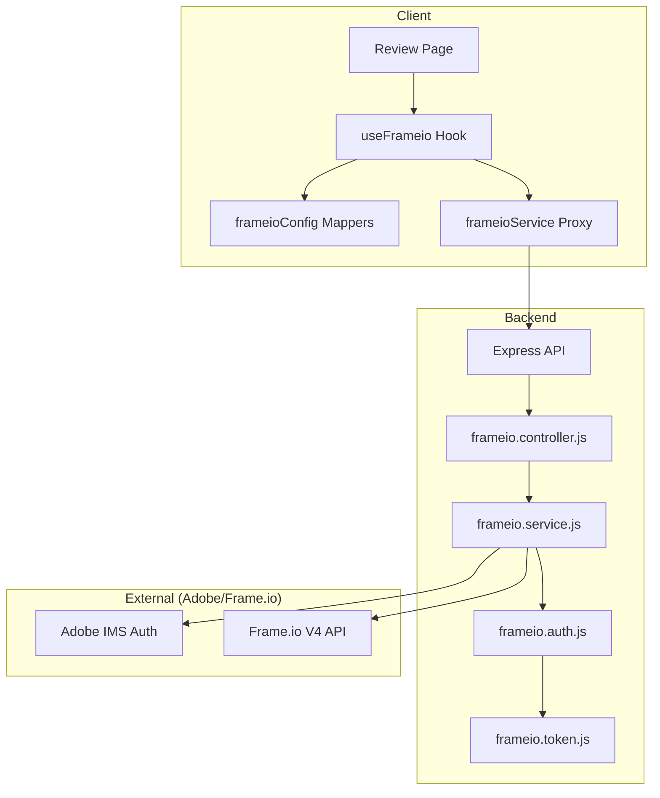

# Adobe Frame.io V4 Integration Documentation

This document outlines the architecture and data flow of the Frame.io integration within Dashify. It covers authentication, asset management, and commenting systems.

## 1. Architecture Overview

The integration bridges the Dashify backend with the Frame.io V4 API, using Adobe IMS for secure authentication.

---

## 2. Authentication Flow (Adobe IMS)

Dashify uses **Adobe IMS** for authentication. Instead of static tokens, it uses a Refresh Token to obtain temporary Access Tokens.

1.  **Token Storage**: Tokens are stored in a local JSON file (`frameio.token.js`) to persist across server restarts.
2.  **Access Token Injection**: The `client()` function in `frameio.service.js` automatically:
    *   Checks if the current Access Token is expired or nearing expiration.
    *   Refreshes the token via `frameio.auth.js` if necessary.
    *   Injects the `Bearer` token and `x-api-key` (Client ID) into every request.

---

## 3. Asset Retrieval & Navigation (V4)

Frame.io V4 is **Account Scoped**. Most endpoints require an `account_id` prefix.

### Navigation Strategy
When Dashify requests assets for a `parentId` (which could be a Folder ID or Project ID):

1.  **Strategy 1 (Folder)**: Attempts to fetch children via `/v4/accounts/:acc/folders/:id/children`.
2.  **Strategy 2 (Project Fallback)**: If Strategy 1 fails (404), it assumes the ID is a Project ID. It fetches the project detail to find the `root_folder_id`, then retries the fetch using that root folder.
3.  **Media Links & Metadata**: All asset requests include:
    *   `include=media_links.original`: For direct video streaming URLs.
    *   `include=metadata`: For video duration and other technical specs.

---

## 4. Playback Logic

*   **V4 Assets**: The `inline_url` from `media_links.original` is mapped to the player's `streamUrl`.
*   **V2 Compatibility**: Fallback logic handles legacy V2 assets using `stream_url` or `h264_1080_best`.
*   **Duration**: Duration is extracted from the V4 `metadata` array (looking for the "Duration" field definition).

---

## 5. Commenting System

Frame.io V4 follows a strict **JSON:API** structure for mutations.

| Action | HTTP Method | Data Wrapper | Endpoint Pattern |
| :--- | :--- | :--- | :--- |
| **Create** | `POST` | `{ data: { text, ... } }` | `/v4/accounts/:acc/files/:file/comments` |
| **Update** | `PATCH` | `{ data: { text, ... } }` | `/v4/accounts/:acc/comments/:comment` |
| **Resolve** | `PATCH` | `{ data: { completed: true } }` | `/v4/accounts/:acc/comments/:comment` |
| **Delete** | `DELETE` | N/A | `/v4/accounts/:acc/comments/:comment` |

---

## 6. Frontend Mapping (`frameioConfig.js`)

The frontend doesn't interact with raw Frame.io data. It uses mappers to convert them to Dashify's internal `Draft` and `Note` shapes:

*   **`mapAssetToDraft`**: Converts a Frame.io asset (file/folder) to a UI-friendly card with status, duration, and color.
*   **`mapCommentToNote`**: Converts a Frame.io comment (comment/annotation) to a timeline note, mapping authors from `user.name` or `owner.name`.

---

## 7. Troubleshooting Common Errors

*   **401 Unauthorized**: Missing `x-api-key` header or expired token.
*   **404 Not Found**: Attempting to use a Project ID where a Folder ID is expected, or missing account scoping in the URL.
*   **422 Invalid Value**: Payload missing the required `{ data: { ... } }` wrapper, or using an incorrect field name (e.g., `body` instead of `text`).
